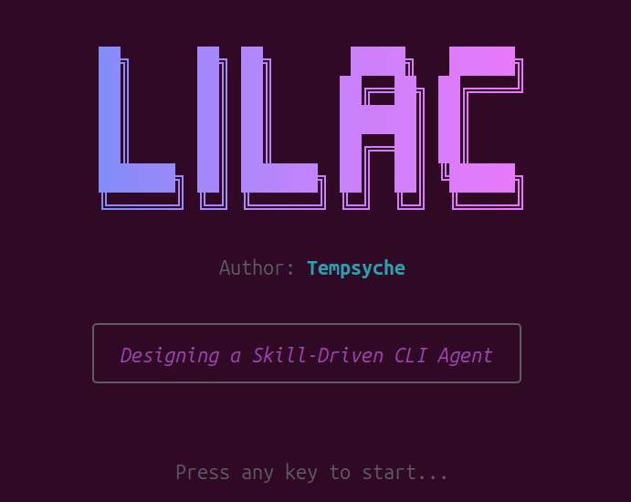

# 🪻 Lilac: A Skill-Driven TUI Agent Framework

> **Lilac** is a high-performance, modular CLI agent system built with **Bun** and **Ink**. It treats AI behaviors as "Skills" stored in Markdown files, allowing you to swap agent identities instantly within a beautiful terminal interface.

> **Lilac** 是一个基于 **Bun** 和 **Ink** 构建的高性能、模块化 CLI 智能体系统。它将 AI 行为视为存储在 Markdown 文件中的“技能 (Skills)”，让你能在精美的终端界面中瞬间切换智能体身份。

---



---

## 🚀 Recent Updates & Technical Highlights / 最新更新与技术亮点

- **Powered by Bun**: Ultra-fast startup, native TypeScript support, and zero-config build.
- **Reactive TUI with Ink**: A modern terminal UI built using React's declarative component patterns.
- **Skill-Driven Architecture**: Define agent personas, constraints, and models in local `.md` files.
- **Real-time Token Tracking**: Built-in high-performance token estimation engine with a live "Cost" monitor in the header.
- **Modern Message Design**: Elegant sidebar-styled message layout inspired by professional developer tools.
- **Rich Visuals**: Features gradient pixel-art headers and smooth streaming animations.
- **Provider Agnostic**: Compatible with any OpenAI-style API (GPT, DeepSeek, Ollama, etc.).
- **Harness Orchestration**: Optional multi-step tool-calling runtime to improve agent reasoning and context access.
- **Claude-Code-like CLI Surface**: Slash commands, session restore, workspace tools, permission modes, doctor/status checks, and non-interactive prompt mode.

- **Bun 驱动**: 极速启动，原生支持 TypeScript，零配置构建。
- **Ink 响应式 TUI**: 使用 React 的声明式组件模式构建现代终端界面。
- **技能驱动架构**: 在本地 `.md` 文件中定义智能体人格、约束和模型。
- **实时 Token 追踪**: 内置高性能 Token 估算引擎，Header 区域实时显示“消耗监控”。
- **现代消息设计**: 借鉴专业开发者工具的优雅侧边线条消息布局。
- **丰富视觉**: 具备渐变像素艺术标题和流畅的流式动画。
- **服务商无关**: 兼容任何 OpenAI 风格的 API (GPT, DeepSeek, Ollama 等)。
- **Harness 编排层**: 可选的多步工具调用运行时，增强智能体推理与上下文获取能力。
- **类 Claude Code CLI 体验**: Slash commands、会话恢复、工作区工具、权限模式、doctor/status 检查，以及非交互式 prompt 模式。

---

## 🧭 Architecture Vision / 架构全景

Lilac now follows a layered agent architecture:
Lilac 现在采用分层智能体架构：

1. **Runtime & Interaction Layer (Bun + Ink)**  
   Bun provides fast startup, TypeScript runtime, and package management.  
   Ink provides the terminal-native React UI, input loop, and streaming rendering.

2. **Identity Layer (Skills)**  
   Skills define the agent's persona, style, constraints, default model, and temperature through Markdown.  
   This keeps "who the agent is" decoupled from orchestration logic.

3. **Capability Layer (Harness)**  
   Harness is the execution substrate for multi-step reasoning and tool use.  
   It standardizes tools (time, token estimation, skill listing, workspace file reading), controls max steps, and provides safe fallback.

4. **Orchestration Layer (OpenAI Agents SDK + LangGraph)**  
   OpenAI Agents SDK strengthens practical tool-driven task execution and agent behavior packaging.  
   LangGraph introduces explicit state-machine/graph orchestration for stable multi-turn workflows, branching, and future checkpoint-style evolution.

5. **Model Access Layer (OpenAI-compatible APIs)**  
   Keeps provider flexibility while preserving the same upper-layer architecture.

---

### Why This Matters / 这套分层的价值

- **Bun + Ink** solve engineering ergonomics and UX responsiveness.  
- **Skills** solve agent identity and role portability.  
- **Harness** solves capability abstraction and reliable execution boundaries.  
- **OpenAI Agents SDK + LangGraph** solve orchestration depth: one emphasizes agent tooling productivity, the other emphasizes graph-level controllability and robustness.

This means Lilac is no longer "just a chat UI", but a composable agent system:
这意味着 Lilac 已不只是聊天界面，而是可组合的 Agent 系统：

`UI interaction -> Skill identity injection -> Harness tool runtime -> Orchestrator scheduling -> Model execution -> streamed response`

---

## 🛠 Tech Stack / 技术栈

| Tool / 工具 | Purpose / 用途 |
| :--- | :--- |
| **[Bun](https://bun.sh/)** | Runtime & Package Manager / 运行环境与包管理 |
| **[Ink](https://github.com/vadimdemedes/ink)** | Core TUI Framework (React for CLI) / 核心 TUI 框架 |
| **Skills (`skills/*.md`)** | Agent identity, behavior contract, and model defaults / 智能体人格、行为约束与默认模型配置 |
| **Harness (`src/harness`)** | Tool runtime, multi-step loop, and fallback strategy / 工具运行时、多步推理循环与回退策略 |
| **OpenAI Agents SDK** | High-level agent tooling orchestration / 高层级工具代理编排能力 |
| **LangGraph** | Graph/state-machine workflow control for agent loops / 基于图与状态机的流程控制 |
| **OpenAI-compatible API** | LLM provider interface (GPT, DeepSeek, Ollama, etc.) / 大模型提供方接口层 |
| `.lilac/` | Local settings and latest session state / 本地设置与最近会话状态 |
| `ink-text-input` | Interactive user input / 交互式用户输入 |
| `ink-spinner` | Thinking/Loading animations / 思考与加载动画 |
| `ink-big-text` | Pixel art terminal headers / 像素艺术终端标题 |
| `ink-gradient` | Colorful gradient text effects / 彩色渐变文本效果 |
| `gray-matter` | Markdown frontmatter parsing / Markdown 前置信息解析 |

---

## 📂 Project Structure / 项目结构

```text
lilac/
├── skills/          # .md Skill definitions / 技能定义文件
├── src/
│   ├── components/  # Ink UI Components / 视觉组件
│   ├── commands/    # Slash command registry / 斜杠命令注册表
│   ├── core/        # Logic & API Clients / 逻辑与 API 客户端
│   ├── harness/     # Tool runtime and orchestrators / 工具运行时与编排器
│   ├── utils/       # Token estimation & helpers / Token 估算与工具类
│   └── index.tsx    # Entry point / 程序入口
├── .lilac/          # Runtime state, created automatically / 自动创建的运行状态
├── .env             # API Configuration / API 配置
└── intro.png        # TUI Screenshot / TUI 截图
```

---

## 🚦 Getting Started / 快速上手

### 1. Installation / 安装

```bash
cd lilac
bun install
```

### 2. Configure API / 配置 API

Copy `.env.example` to `.env` and add your `LILAC_API_KEY`.
将 `.env.example` 复制为 `.env` 并添加你的 `LILAC_API_KEY`。

```bash
cp .env.example .env
```

Optional Harness switch / 可选 Harness 开关：

```env
LILAC_ENABLE_HARNESS=true
LILAC_ORCHESTRATOR=auto
LILAC_MAX_REASONING_STEPS=4
```

When enabled, Lilac can run a multi-step tool loop with built-in tools such as current time, skill listing, token estimation, and workspace file reading.
开启后，Lilac 可使用多步工具循环，并内置当前时间、技能列表、Token 估算、工作区文件读取等能力。

Orchestrator modes:
- `auto`: Prefer OpenAI Agents SDK, then LangGraph, then built-in fallback.
- `openai-agents`: Force OpenAI Agents SDK first (fallback still enabled).
- `langgraph`: Force LangGraph state graph first (fallback still enabled).
- `builtin`: Use the internal tool-loop only.

编排模式说明：
- `auto`：优先尝试 OpenAI Agents SDK，再尝试 LangGraph，最后使用内置循环。
- `openai-agents`：优先使用 OpenAI Agents SDK（仍保留回退）。
- `langgraph`：优先使用 LangGraph 状态图（仍保留回退）。
- `builtin`：仅使用内置工具循环。

### 3. Run / 运行

```bash
# Development mode (with HMR) / 开发模式 (热更新)
bun run dev

# Production start / 生产启动
bun run start

# Non-interactive prompt / 非交互式调用
bun src/index.tsx "summarize this repository"

# Type check / 类型检查
bun run typecheck
```

## ⌨️ Commands / 斜杠命令

Inside the TUI, Lilac now supports a Claude-Code-like command surface:
在 TUI 中，Lilac 现在支持一组类 Claude Code 的斜杠命令：

| Command / 命令 | Purpose / 用途 |
| :--- | :--- |
| `/help` | Show available commands / 查看命令 |
| `/status` | Show runtime status, model, skill, tokens, and config / 查看运行状态 |
| `/model [name]` | Show or set model override / 查看或设置模型 |
| `/skills [name]` | List or switch skills / 列出或切换技能 |
| `/permissions [ask\|auto\|deny]` | Show or set workspace tool permission mode / 查看或设置工具权限模式 |
| `/files [path]` | List workspace files / 列出工作区文件 |
| `/search <pattern>` | Search workspace with ripgrep / 使用 ripgrep 搜索工作区 |
| `/doctor` | Run local health checks / 运行本地健康检查 |
| `/compact` | Replace conversation with a local summary / 本地压缩会话上下文 |
| `/clear` | Clear visible conversation / 清空当前可见会话 |
| `/exit` | Exit Lilac / 退出 |

Workspace tools available to the harness:
Harness 可用的工作区工具：

- `read_workspace_file`
- `list_workspace_files`
- `search_workspace`
- `write_workspace_file`
- `run_shell_command`

`write_workspace_file` and `run_shell_command` require `/permissions auto`.
`write_workspace_file` 与 `run_shell_command` 需要先设置 `/permissions auto`。

---

## 🎭 Creating Skills / 创建技能

Skills are simple Markdown files. Example `skills/coder.md`:
技能是简单的 Markdown 文件。例如 `skills/coder.md`：

```markdown
---
name: Coder-Expert
model: gpt-4o
temperature: 0.2
---

# Role
You are an expert TypeScript developer.
你是一位精通 TypeScript 的开发者。
```

---

## 👤 Author / 作者

**Tempsyche**

---

## 📄 License / 许可证

MIT License. Feel free to use and extend!
MIT 许可证。欢迎自由使用与扩展！
